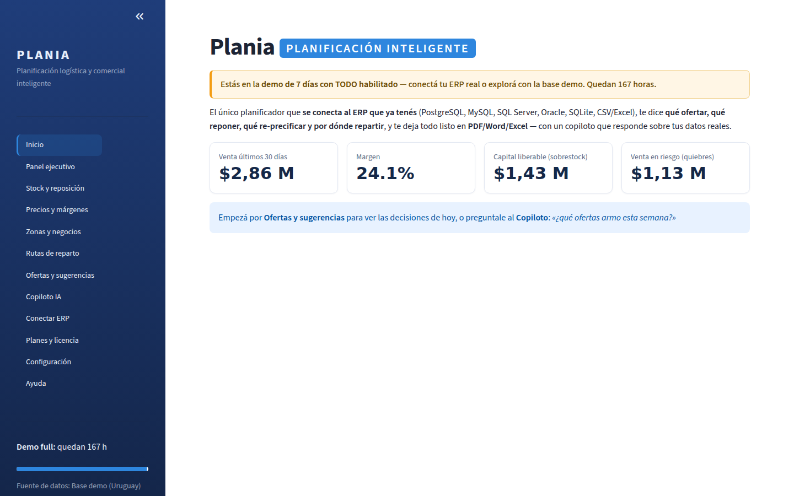
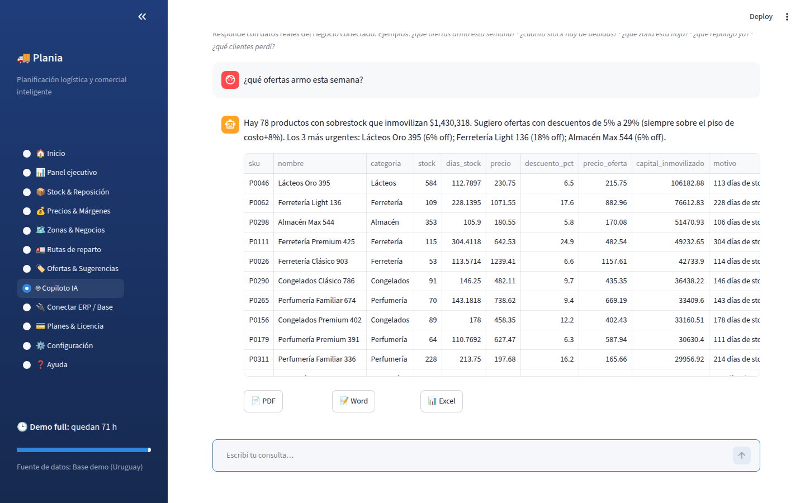
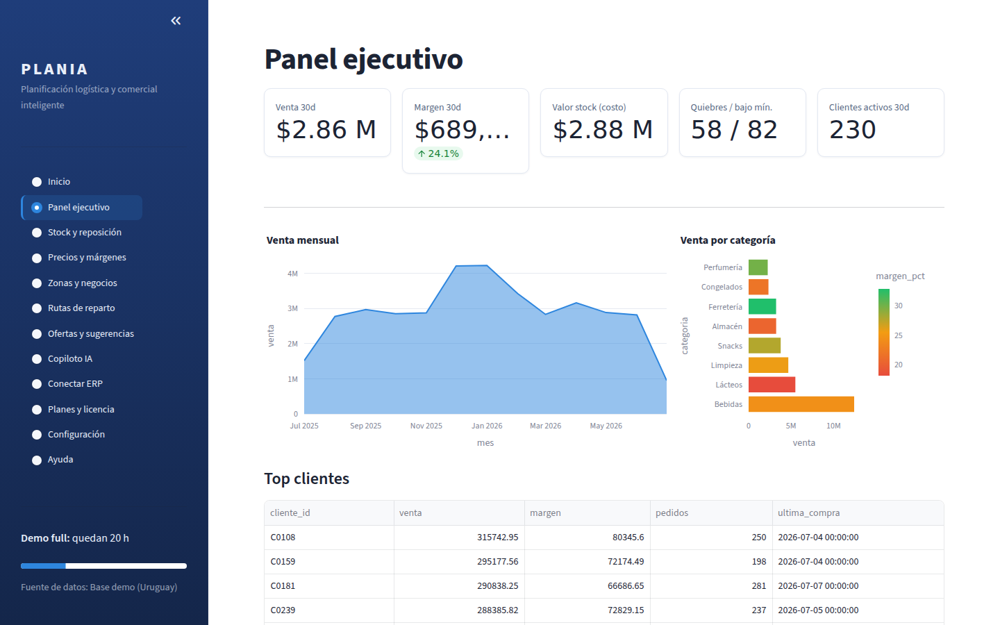
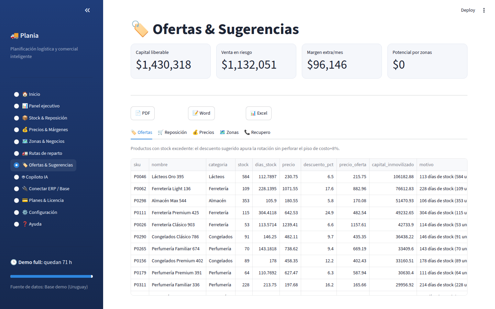

# 🚚 Plania · Planificación logística y comercial inteligente

Programa **PC (Windows) + Web** para distribuidores, mayoristas y comercios de
Uruguay/LATAM. Se conecta al ERP o base de datos que el negocio **ya tiene**,
y convierte los datos en decisiones: **qué ofertar, qué reponer, qué
re-precificar, qué zona atacar y por dónde repartir** — con un copiloto IA
que responde consultas sobre los datos reales y exporta todo a
**PDF, Word y Excel**.

## El producto

| | |
|---|---|
|  |  |
| *Inicio: demo 7 días full + resumen en pesos* | *Copiloto: consultas reales + export PDF/Word/Excel* |
|  |  |
| *Panel ejecutivo* | *Ofertas y sugerencias accionables* |

## Descargas (Windows)

**Sin esperar nada — hoy mismo, desde GitHub:**

1. Botón verde **Code → Download ZIP** (o [este enlace directo](../../archive/refs/heads/main.zip)).
2. Descomprimir y hacer **doble clic en `INICIAR_PLANIA.bat`** — la primera vez
   crea el entorno e instala todo solo (requiere tener
   [Python 3.11+](https://www.python.org/downloads/) instalado con
   "Add to PATH"); las siguientes abre directo.

**Ejecutables .exe, sin requisitos:** los genera el workflow **Release**, y
quedan siempre frescos en [`INSTALADOR/`](INSTALADOR/). Se dispara solo con
cada push a `main` que toca el producto (`app/`, `plania/`, `packaging/`,
`desktop/`, `data/`, `assets/`, `requirements.txt`) — no hay que ir a Actions
a apretar nada. Publicar una versión con changelog en
[Releases](../../releases) sigue siendo una decisión aparte: se hace
pusheando un tag (`git tag v1.0.1 && git push --tags`) o con *Run workflow*.
Hay dos instaladores Windows, no uno solo:

| Archivo | Es | Elegís carpeta de instalación |
|---|---|---|
| `Plania Setup *.exe` | Electron + React — ventana propia, todo embebido | sí |
| `Plania_Setup_v*.exe` | Liviano (Inno Setup), ventana propia sin barra de direcciones — es el que se descarga después de pagar | sí |

Los dos son instaladores completos: no hace falta tener Python ni nada
instalado. También está `Plania_portable.zip` (el liviano, sin instalar) y
`Plania_BAT.zip` (requiere Python).

Los dos abren **una ventana de programa**: sin barra de direcciones, sin
pestañas, con su ícono propio en la barra de tareas.

El de Electron trae **interfaz React propia**: las 12 pantallas están escritas
en React y le piden los datos a una API local (`plania/api.py`) que corre en
la misma máquina y escucha sólo en 127.0.0.1. Streamlit ya no interviene en el
escritorio — sigue siendo lo que sirve la versión web.

El liviano consigue la ventana usando el modo aplicación de Edge (que viene en
todo Windows 10 y 11) en vez de empaquetar un navegador entero — por eso pesa
una fracción del de Electron. Si la máquina no tuviera ningún navegador basado
en Chromium, se abre el navegador por defecto: peor, pero funciona. Detalle en
`packaging/ventana.py`.

*Nota: requiere GitHub Actions habilitado para el repo — ver la nota en
`.github/workflows/ci.yml`.* También se pueden construir localmente en
Windows (`python packaging/build_release.py` y `desktop/ → npm run dist`).

## Interfaz de escritorio (React) y API local

El programa instalado dibuja su propia interfaz en React y le pide los datos a
una API local. Son dos piezas:

```
plania/api.py               API local — 12 pantallas, exportes, ERP, licencia
desktop/renderer/ui/        interfaz React (sin paso de compilación)
```

Para trabajar en la interfaz sin empaquetar nada:

```bash
uvicorn plania.api:app --host 127.0.0.1 --port 8777    # el motor
# y abrir desktop/renderer/ui/index.html en el navegador
```

Dos reglas que sostienen el diseño, y que tienen test:

- **La API no calcula nada.** Cada endpoint llama a los módulos que ya existen
  (`analitica`, `sugerencias`, `rutas`, `copiloto`) y traduce a JSON. Un test
  compara sus KPIs contra los de la función original y falla nombrando el que
  divergió.
- **La interfaz tampoco calcula.** Formatea y muestra. Si el JavaScript
  multiplicara o promediara un dato de la API habría dos fuentes de verdad, y
  el día que difieran la diferencia se ve delante de un cliente.

Las funciones de plan (rutas, copiloto, exportes) se controlan **en la API**, no
escondiendo el botón: un endpoint abierto se llama igual desde la consola.

## Probarlo en 60 segundos

```bash
./run.sh            # instala deps, genera la base demo (Uruguay) y abre la app
```

o por partes:

```bash
pip install -r requirements.txt
python3 data/generate_dataset.py     # base demo: 320 productos, 260 clientes, 12 meses de ventas
streamlit run app/app.py             # la aplicación (web / la misma que empaqueta el .exe)
uvicorn backend_venta.app:app --port 8100   # backend de venta (licencias + MercadoPago)
python3 -m plania.verificacion       # verificación end-to-end del producto
```

## Correr los tests

En una máquina limpia, sin nada instalado más que Python 3.11+ — no hace
falta preguntarle a nadie qué más hace falta, está todo declarado:

```bash
pip install -r requirements-dev.txt   # incluye requirements.txt + pytest/coverage
python3 -m pytest tests/              # 96 tests (101 casos: hay parametrizados)
```

Dos tests se saltean solos, con motivo explícito, si falta algo opcional que
no hace falta para correr el producto — no rompen la corrida:
- **Compilar el protector de código** (`packaging/proteger_codigo.py`,
  Cython) necesita un compilador de C (`gcc`/`cc`). `Cython` ya está en
  `requirements-dev.txt`; el compilador es del sistema operativo.
- **La voz del video** (`imageio_ffmpeg`) es de `sitio/requirements.txt`
  (herramientas de la web, no del producto) — instalalo aparte si además
  querés tocar `sitio/doblar_video.py`.

Para medir cobertura:

```bash
coverage run -m pytest tests/ -q && coverage report -m
```

Al primer arranque se activa sola la **demo de 7 días con todo habilitado**.

## Qué lo diferencia

| Diferenciador | Dónde está |
|---|---|
| 🔌 **Conector universal**: PostgreSQL, MySQL, SQL Server, Oracle, SQLite, CSV/Excel con **auto-mapeo de columnas** (Zureo, Memory, Tango, Bejerman, Odoo, SAP B1…) | `plania/conectores.py` |
| 🤖 **Copiloto IA sobre datos reales**: responde en español calculando contra la base conectada; con `ANTHROPIC_API_KEY` redacta con Claude, sin key funciona igual (motor local) | `plania/copiloto.py` |
| 🏷️ **Sugerencias accionables**: ofertas por sobrestock (piso costo+8%), reposición antes del quiebre, ajustes de precio, venta cruzada por zona, recupero de clientes | `plania/sugerencias.py` |
| 📄 **Exportes profesionales** PDF / Word / Excel de cualquier análisis o respuesta del copiloto | `plania/exportes.py` |
| 🚛 **Rutas de reparto** optimizadas (vecino más cercano + 2-opt, con o sin GPS) | `plania/rutas.py` |
| 🎁 **Demo 7 días full** sin tarjeta, autoactivada; licencias JWT por plan | `plania/licencia.py` |
| 💳 **Venta automática con MercadoPago**: checkout + webhook verificado + emisión de licencia + descarga del instalador — **hace falta desplegar el backend** (`render.yaml`, un clic); sin eso la web no cobra y no se puede activar ninguna licencia | `backend_venta/` |
| 💻 **Programa PC**: PyInstaller + Inno Setup → `Plania_Setup.exe` y ZIP portable | `packaging/` |

Más detalle comercial: [`docs/COMPARATIVA_COMPETENCIA.md`](docs/COMPARATIVA_COMPETENCIA.md)
y [`docs/MODELO_COMERCIAL.md`](docs/MODELO_COMERCIAL.md).

## Para el dueño del negocio (Plania Owner)

**Programa aparte, no una versión especial de Plania.** El producto es un solo
build: el `Plania_Setup.exe` que corre el dueño es el mismo archivo que
descarga cualquiera que lo compre. Si hubiera una versión propia, el dueño
estaría probando un programa que ningún cliente tiene — y un problema
reportado por un comprador podría no reproducírsele nunca.

Lo del negocio vive en un ejecutable separado, que solo se instala en su
máquina y no se publica:

```bash
python packaging/build_release.py --con-owner   # deja dist/Plania_Owner.zip
```

Desde el código, sin empaquetar:

```bash
PLANIA_OWNER_TOKEN=tu-token streamlit run app/owner.py --server.port 8600
```

| Sección | Qué resuelve |
|---|---|
| Estado del negocio | Demos, conversión, MRR/ARR, costo de IA, margen y clientes en riesgo — leídos del log de auditoría y la base de uso, no cargados a mano |
| Clientes y licencias | Historial de licencias, consumo por cliente y emisión manual para ventas fuera de MercadoPago |
| Proyección de rentabilidad | Los 3 escenarios en vivo: equilibrio, mes en que supera un sueldo, caja mínima, LTV/CAC |
| Mercado y competencia | TAM/SAM/SOM en Uruguay, LATAM y el mundo, más sensibilidad |
| Contenido para redes | Posts, guiones, prospección, calendario y pauta generados sobre datos reales |
| Verificación del producto | Corre la cadena completa y da un puntaje sobre 10 |

Eso es el panel de **métricas del negocio**. Aparte, y para lo que se
pregunta seguido — "yo soy el dueño, ¿por qué me corre el reloj de la demo
como a un cliente" — existe una **licencia `owner`** para el programa
principal (`app/app.py`), sin cupo, con todas las features y sin vencimiento
real (100 años):

```bash
python3 packaging/generar_licencia_owner.py vos@tu-dominio.uy
```

Pegá el token que imprime en **Planes y licencia → Ya tengo mi licencia**, y
esa instalación deja de tener restricciones — igual que un cliente Enterprise,
con vos como titular.

Por qué esto no sale de una variable de entorno tipo `PLANIA_OWNER_MODE=1`
que cualquiera pudiera prender: activar una licencia se valida contra el
`backend_venta` desplegado (ver "Licencias" en la Verificación end-to-end,
más abajo) — el cliente ya no le cree a un token porque dice "soy el dueño",
sólo a lo que el backend confirma con el secreto de firma real, que solo
tiene quien despliega ese backend. Es la misma licencia paga de siempre, con
otro plan.

## Web pública (español · inglés · portugués)

La web de venta vive en `web/` y se publica en Vercel con **Import → Deploy**,
sin tocar ningún campo: el `vercel.json` de la raíz del repo ya declara que el
sitio sale de `web/` y que no hay build (ver `docs/DESPLIEGUE.md`). No se
edita a mano: los textos están en `sitio/i18n/{es,en,pt}.json`, la home en
`sitio/plantilla.html` y la página de implementadores en
`sitio/plantilla_implementador.html`.

```bash
pip install -r sitio/requirements.txt && playwright install chromium   # una vez
python3 sitio/build.py              # genera /{es,en,pt}/ + /{es,en,pt}/implementadores/
python3 sitio/doblar_video.py       # subtítulos de las tres pistas + informe de calce
python3 sitio/verificar_layout.py   # comprueba que nada se solapa, en las dos páginas
```

La home nombra los ERP que el conector realmente reconoce (Zureo, Memory,
Tango, Bejerman, Odoo, SAP Business One — cada uno con su propia sección, no
una lista genérica) y muestra las cinco sugerencias del producto con un
ejemplo numérico real, corrido sobre la base de demostración. La página de
implementadores (`/implementadores/`, mismo slug en los tres idiomas) explica
el esquema de comisión recurrente para quien conecta el ERP del cliente.

Tres decisiones que explican el resto:

- **Un HTML por idioma**, no traducción por JavaScript: sin parpadeo de texto
  sin traducir, con `hreflang` real y funcionando aunque el visitante tenga el
  JavaScript bloqueado.
- **El video es el producto de verdad**, grabado manejando la aplicación con un
  navegador (`sitio/grabar_demo.py`), no una animación.
- **La misma voz en los tres idiomas**, clonada, sin cuenta y sin pagar por
  carácter. Se clona la voz de `sitio/narracion/voz_referencia.wav` —quince
  segundos de la narración original— y se la hace hablar los tres idiomas, así
  que el timbre es el mismo en las tres versiones.

  ```bash
  python3 sitio/doblar_video.py --doblar   # chatterbox-tts ya está en sitio/requirements.txt
  ```

  Cada segmento se sintetiza por separado y se coloca en su marca de tiempo,
  así el doblaje no se corre de la imagen. Es gratis, o sea que re-doblar
  después de cambiar una línea del guion no cuesta nada.

  Alternativas: `--motor voicebox` (la app de escritorio
  [VoiceBox](https://voicebox.sh/), por su API local) y `--motor elevenlabs`
  (pago). Sin ningún motor instalado el video igual se entiende en los tres
  idiomas: los subtítulos se generan sin nada.

`sitio/verificar_layout.py` mide en el navegador —no a ojo— que en 3 idiomas x
3 anchos (360, 768 y 1440 px) no haya scroll horizontal, elementos fuera de
pantalla, texto recortado ni elementos pisándose. Hace falta porque el mismo
texto en portugués e inglés corre entre 15% y 35% más largo que en español.

## Verificación end-to-end

En vez de afirmar que funciona, se comprueba ejecutando cada pieza:

```bash
python3 -m plania.verificacion
```

Devuelve OK / ADVERTENCIA / FALLA por componente (datos, auto-mapeo, analítica,
sugerencias, copiloto, exportes, rutas, licencias, backend, MercadoPago,
contenido, negocio y distribución) y un puntaje. Sale con código 1 si hay
alguna falla, así que sirve en CI o antes de una demo con un cliente.

Eso comprueba las piezas. Lo que ninguna de ellas cubre —porque no levantan la
aplicación— es que las pantallas se **dibujen**:

```bash
python3 packaging/verificar_pantallas.py    # tarda unos minutos: abre el producto de verdad
```

Levanta Plania con una configuración limpia (pasa por el gate de la EULA como
un usuario que instala por primera vez) y recorre las 12 pantallas con un
navegador, buscando lo único que un cliente que pagó no puede ver nunca: un
traceback en pantalla. Un `KeyError` que solo aparece al dibujar pasa la suite
entera de tests y explota en la demo con el cliente.

Correrlo antes de cada release, junto con:

```bash
python3 packaging/verificar_instalador.py   # 34 controles del instalador Windows
python3 sitio/verificar_layout.py           # la web no se solapa en 3 idiomas x 3 anchos
```

## Análisis de negocio

[`docs/ANALISIS_NEGOCIO.md`](docs/ANALISIS_NEGOCIO.md) — rentabilidad neta en 3
escenarios a 1/3/6/12/18 meses con y sin inversión en redes, mercado potencial
en Uruguay/LATAM/mundo, competencia, plan de escalado de vender solo a tener
equipo, y riesgos. Los números salen de `plania/negocio.py` y se recalculan:

```bash
python3 -c "from plania import negocio; print(negocio.comparativa_escenarios())"
```

## Arquitectura

```
app/app.py            Dashboard Streamlit (12 pantallas, menú profesional) — web y PC
app/owner.py          Panel del dueño (versión owner) — puerto y token aparte
plania/               Núcleo: conectores, analítica, sugerencias, copiloto,
                      exportes, rutas, licencia, config segura, auditoría,
                      negocio (modelo financiero), contenido (redes),
                      owner (datos del negocio), verificacion (end-to-end)
backend_venta/        FastAPI: planes, trial 7 días, checkout MercadoPago,
                      webhook de pago, gateway IA medido, descarga instalador
data/                 Generador de base demo + ERP SQLite de ejemplo
packaging/            Launcher, spec PyInstaller, instalador Inno Setup, build
sitio/                Fuentes de la web: textos por idioma, plantilla,
                      generador, grabación del video, doblaje y control de
                      maquetación
web/                  Web pública generada (Vercel): /es/ /en/ /pt/
tests/                96 tests (conectores, analítica, sugerencias, copiloto,
                      exportes, rutas, licencias, backend de venta —
                      incluidos webhook de pago, checkout, cupo y descarga
                      del instalador—, negocio, contenido, seguridad web
                      (XSS, rate limiting), verificación end-to-end)
```

## Construir el programa PC (Windows)

```bash
pip install -r requirements.txt pyinstaller cython
python packaging/build_release.py    # → dist/Plania_Setup_vX.exe + Plania_portable.zip
```

El build compila `plania/` (el motor de negocio: sugerencias, copiloto,
modelo financiero, rutas, licenciamiento) a extensiones nativas con Cython
antes de armar el ejecutable, así el instalador y el portable no llevan el
código fuente en texto plano — ver el porqué y los límites reales de esto
en `packaging/proteger_codigo.py`. Para iterar rápido sin compilar nada:
`python packaging/build_release.py --sin-proteger` (no usar ese build para
distribuir).

`backend_venta/` nunca viaja al cliente: es el servidor de venta del
Licenciante, no algo que el comprador de una licencia deba recibir.

El instalador (`packaging/instalador.iss`, Inno Setup) tiene panel de
bienvenida/cierre propio y logo en las páginas intermedias — la misma marca
que el ícono de la app, no el asistente genérico gris. Las imágenes se
generan, no se suben a mano:

```bash
python3 packaging/generar_imagenes_instalador.py
```

Salen de leer los colores reales de `assets/brand/plania_icon.png`, así que
si el logo cambia algún día, correr el script de nuevo alcanza para que el
instalador lo siga.

## Licencia de uso (EULA)

El uso de Plania —demo o pago— está sujeto a
[`LICENSE-EULA.md`](LICENSE-EULA.md). La app pide aceptarla una sola vez
por instalación, antes de cualquier pantalla con datos (`plania/licencia.py`:
`eula_aceptada()` / `aceptar_eula()`).

## Configuración (pantalla ⚙️ o variables de entorno)

Las credenciales se guardan con keyring del SO > archivo cifrado > texto
plano (`plania/config.py`). Claves: `ANTHROPIC_API_KEY` (copiloto IA),
`ERP_DB_URL` (base del cliente), `MP_ACCESS_TOKEN` (cobros), SMTP.
